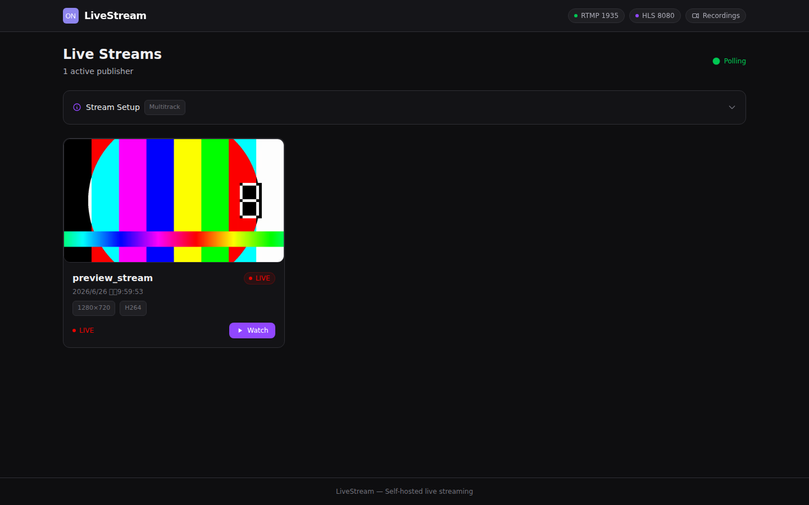
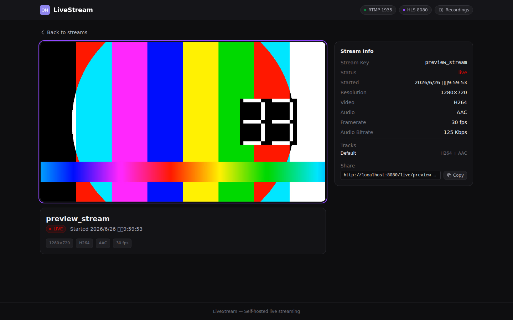

# LiveStream Platform — Architecture & Operations Guide

## 1. Overview

LiveStream Platform is a self-hosted live streaming server that ingests RTMP streams, transmuxes them into HLS (fMP4/CMAF) for browser playback, records sessions as MP4 files, and generates JPEG XL, AVIF, and PNG thumbnails. It consists of:

- **Rust backend** — RTMP ingestion, HLS generation, recording, REST API
- **Vue 3 frontend** — Stream dashboard, live player, recordings library
- **nginx** — Reverse proxy, static file serving, HLS caching

### Preview

| Dashboard (live streams) | Player (multitrack stream) |
|---|---|
|  |  |

## 2. System Architecture

```
┌─────────────────┐     RTMP      ┌─────────────────────────────┐
│  OBS / FFmpeg   │──────────────▶│  Rust Server (port 1935)    │
│  Stream Source  │               │  - RTMP session handler     │
└─────────────────┘               │  - HLS fMP4 muxer           │
                                  │  - MP4 recorder             │
                                  │  - Thumbnail generator      │
                                  └──────────────┬──────────────┘
                                                 │
┌─────────────────┐     HTTP      ┌──────────────▼──────────────┐
│  Vue 3 SPA      │◀──────────────│  nginx (port 8080)          │
│  (HLS.js player)│               │  - /api/   → localhost:8081 │
│                 │               │  - /hls/   → localhost:8081 │
│                 │               │  - /       → frontend/dist  │
│                 │               │  - /recordings/ → static    │
│                 │               │  - /thumbnails/ → static    │
└─────────────────┘               └─────────────────────────────┘
```

### Port Allocation

| Service | Port | Purpose |
|---------|------|---------|
| nginx | 8080 | Public HTTP entry (SPA + API proxy + HLS proxy) |
| Rust API / HLS | 8081 | Internal API and HLS file serving (proxied by nginx) |
| RTMP | 1935 | Stream ingestion |

### DiskWriter

All disk I/O (HLS segments, playlists, recordings, thumbnails) is decoupled from RTMP sessions via a channel-based `DiskWriter`. The RTMP session handler sends `DiskCommand` variants through a bounded `mpsc` channel (capacity 10,000) to a dedicated tokio task that serializes all filesystem operations. This prevents slow disk I/O from blocking the RTMP ingest pipeline.

In local dev, `vite dev server` runs on port 3000 and proxies `/api`, `/hls`, `/recordings` to `localhost:8080` (nginx).

## 3. Backend Architecture (`server/`)

### 3.1 RTMP Ingestion (`rtmp/`)

- **`rtmp/server.rs`** — `TcpListener` accepting RTMP connections, spawning a `tokio` task per session.
- **`rtmp/session.rs`** — Full RTMP handshake and session lifecycle:
  - Handshake (`rml_rtmp::handshake::Handshake`)
  - Session event loop (`ServerSession::handle_input`)
  - Event dispatch: `ConnectionRequested`, `PublishStreamRequested`, `VideoDataReceived`, `AudioDataReceived`, `StreamMetadataChanged`, `PublishStreamFinished`
  - **Grace period**: On disconnect, the stream enters a grace period (default 30s). If the publisher reconnects within the grace period, the existing `HlsStreamState` and `Fmp4Recorder` are resumed. Otherwise, the stream is finalized.
- **`rtmp/enhanced.rs`** — Parses Enhanced RTMP headers (ExVideo/ExAudio, FFmpeg veovera format) to detect AV1, H.264, H.265 (HEVC), Opus, AAC, FLAC codecs. Supports **multitrack** streams (OBS/FFmpeg veovera v2 spec) with per-track codec detection and OneTrack / ManyTracks / ManyTracksManyCodecs layouts.
- **`rtmp/amf.rs`** — AMF0 parser with depth-limited recursion (max depth 16) for Enhanced RTMP metadata. Handles Numbers, Strings, Objects, ECMA Arrays, Strict Arrays, and null/undefined values. Used to parse `colorInfo`, `hdrCll`, and `hdrMdcv` from Enhanced RTMP packets.
- **`rtmp/color.rs`** — Color config and HDR metadata extraction from Enhanced RTMP packets. Supports both AMF0 wire format (OBS/veovera) and binary format (FFmpeg). HDR metadata includes CLLI (maxCLL/maxFALL) and MDCV (display primaries, white point, luminance).
- **`rtmp/mod.rs`** — `StreamManager` holds two `HashMap`s:
  - `publishers`: active publishers with metadata and a `tracks` array (track_id, hls_url, video_codec, audio_codec)
  - `pending_streams`: disconnected but grace-period-active streams

### 3.2 HLS Generation (`hls/`)

- **`hls/mod.rs`** — `HlsStreamState` manages per-stream HLS output:
  - Writes `init.mp4` (ftyp + moov with codec config)
  - Writes `.m4s` segments (moof + mdat)
  - Maintains `index.m3u8` playlist
  - **Multitrack**: Each additional video track gets its own `track_N/` subdirectory with independent `init.mp4`, segments, and playlist. A `master.m3u8` references all available tracks.
  - **init.mp4 timing**: `write_init_segment()` is called inside `rotate_segment()`, ensuring init.mp4 is written when the first segment is created (after both video and audio configs have typically arrived). Codec, audio, color, and HDR config changes while a segment is open refresh the init file immediately so the active playlist map stays compatible with the current samples. Init is atomically written via `init.mp4.tmp` → `rename()`.
  - **Resolution**: `set_video_config()` receives actual width/height from RTMP metadata (defaults 1920×1080). `update_video_resolution()` updates the muxer dimensions only; resolution-only changes do not trigger an init rewrite.
- **`hls/fmp4/mod.rs`** — Low-level fMP4 (CMAF) muxer:
  - Supports H.264, H.265 (HEVC), AV1 video + AAC, Opus, FLAC audio
  - Generates `init_segment()` (ftyp + moov), `flush_combined_fragment()` (moof + mdat)
  - Uses Sample tables with duration computation, composition time offsets, and proper `trex` defaults. Audio decode time is tracked in the codec media timescale for known fixed-frame codecs (AAC 1024-sample frames, Opus 960, FLAC 4096) so audio `tfdt.baseMediaDecodeTime` stays on the same sample grid as `tfhd.default_sample_duration` instead of being derived from rounded RTMP millisecond timestamps.
  - **A/V sync (edit-list policy)**: Each codec handles pre-roll differently so the muxer never writes a one-size-fits-all `edts/elst`. Video relies on **CTS normalization** — the first sample's PTS−DTS diff is stored as `first_cts_offset` and subtracted from every sample, so the first `composition_time_offset` in every `trun` is always 0 (no video `edts`). **AAC** carries its MDCT encoder pre-roll inside the RTMP frames (FLV does not signal encoder delay), so an `edts/elst` with `media_time = 1024` (one AAC-LC frame, `AAC_PRIMING_SAMPLES`) is written on the AAC trak to skip the priming and align real audio with video at t=0; `segment_duration = 0` extends the edit to the end of the fragmented track (standard CMAF/HLS convention). **Opus** signals pre-roll via the `roll` sample group (`sgpd`/`sbgp`) plus `pre_skip` in `dOps` (no `edts`). **FLAC** has no encoder delay (no `edts`). The policy is enforced by `tests/edts_check.py` in `check_mp4()`.
  - **HDR metadata passthrough**: Writes `colr` (nclx with color_primaries / transfer_characteristics / matrix_coefficients / full_range), `clli` (maxCLL / maxFALL), and `mdcv` (display primaries, white point, luminance) boxes into the video sample entry. HDR metadata is sourced from three paths: (1) Enhanced RTMP AMF0 `colorInfo` (OBS/veovera), (2) Enhanced RTMP binary format (FFmpeg), (3) HEVC hvcC SEI NAL units and AV1 metadata OBUs (`hls/fmp4/codec.rs`). AV1 color config is also extracted from codec configuration OBU.
- **`hls/fmp4/codec.rs`** — RFC 6381 codec string builders (avc1, hvc1, av01, mp4a, opus, fLaC), AV1 OBU parsing and normalization (`ensure_av1_obu_size_fields`, `av1c_box_from_config`), HEVC hvcC SEI HDR extraction (`hevc_hdr_metadata_from_hvcc`), AV1 metadata OBU HDR extraction (`av1_hdr_metadata_from_obus`), and audio config builders (`build_esds`, `build_dops`, `build_dfla`).

### 3.3 Recording (`recording/`)

- **`recording/mod.rs`** — `Fmp4Recorder`:
  - Streams recording data incrementally via `DiskWriter` channel commands (`CreateRecording`, `WriteRecordingData`, `CloseRecording`) — no in-memory buffering of the entire recording
  - `write_init()` creates the recording file and writes the init segment (ftyp + moov). Init hash tracking prevents duplicate moov atoms on reconnect
  - `write_segment()` rewrites each segment's `tfdt.baseMediaDecodeTime` to maintain a continuous timeline across reconnections, with gap detection and bridging
  - On `close()`, sends `CloseRecording` which syncs and closes the file handle — output is `{stream_key}_{YYYYMMDD}_{HHMMSS}.mp4`
  - `update_index_json()` atomically updates `recordings/index.json` with metadata and thumbnail URLs
- **`RemuxQueue`** — Optional background FFmpeg remux after recording finalization:
  - Runs asynchronously after `recorder.close()` so stream shutdown is never blocked
  - Uses `-movflags +faststart+negative_cts_offsets`: `+faststart` relocates `moov` to the front for maximum player compatibility; `+negative_cts_offsets` keeps B-frame video on negative `ctts` (no video `edts`), consistent with the fMP4 muxer's CTS-normalization design. `-use_editlist` is left at ffmpeg's default (`auto`) so the **AAC audio `elst`** (pre-roll skip) is preserved/propagated through the remux rather than stripped — the mov demuxer otherwise applies it during demux, dropping the priming either way, so recording A/V sync is correct.
   - Adds `-strict -2` for FLAC-in-MP4 compatibility (required by older FFmpeg versions).
  - Concurrency controlled via `tokio::sync::Semaphore` (`RECORDING_REMUX_CONCURRENCY`, default 4)
  - Configurable via `RECORDING_REMUX_ENABLED` (default true) — no remux performed when disabled (file is already a valid fragmented MP4 with moov at front)

### 3.4 Thumbnails (`thumbnail.rs`)

Top-level module at `server/src/thumbnail.rs`, using a two-phase ffmpeg pipeline for multi-format thumbnail generation:

**Phase 1 — PNG ref extraction**: A single ffmpeg call with `filter_complex` split+scale decodes the source video once and produces one PNG reference per configured width. This eliminates redundant MP4 reads when generating multiple resolutions.

**Phase 2 — Format encoding**: JXL and AVIF are encoded from the cached PNG refs in separate ffmpeg calls. PNG is always available (built-in encoder). JXL (`libjxl`) and AVIF (`libaom-av1`) are detected at startup via `probe_codecs()` and silently skipped if unavailable.

- **Live thumbnails**: Concatenates `init.mp4` + latest `segment*.m4s` into a temp MP4, then runs the two-phase pipeline
- **Recording thumbnails**: Directly from the finalized MP4
- **Atomic writes**: ffmpeg writes to `{output}.{fmt}.tmp`, then renames to `{output}.{fmt}` only after success. nginx never serves a partially-written file.
- **Rate limiting**: Per-stream rate limiting via `THUMBNAIL_RATE_LIMIT_SECONDS` (default 5s) with atomic timestamp tracking
- **Concurrency**: Separate semaphores for live and recording thumbnails (`THUMBNAIL_FFMPEG_CONCURRENCY`, default 4)
- **Once-mode**: When `THUMBNAIL_LIVE_UPDATE=false`, each live stream gets a single thumbnail (generated once when none exists) instead of continuously refreshing
- **Cleanup**: Stale 0-byte thumbnails are cleaned before generation. Live stream thumbnails are deleted when the stream ends; recording thumbnails persist indefinitely.
- Output formats: **JPEG XL** (`-c:v libjxl -q:v 90`), **AVIF** (`-c:v libaom-av1 -crf 30 -still-picture 1`), **PNG** (fallback, always generated)
- **Priority**: JXL → AVIF → PNG (browser picks first supported format via `<picture>`)

### 3.5 API (`api/`)

Axum router with these endpoints:

| Endpoint | Description |
|----------|-------------|
| `GET /api/health` | Health check |
| `GET /api/streams` | List active streams with metadata and `tracks` array |
| `GET /api/streams/{key}` | Get single stream details (includes `tracks` with per-track HLS URLs and codecs) |
| `GET /api/recordings` | List recordings (from index.json or fallback scan) |
**HLS content-type middleware**: Sets correct MIME types for HLS segments (`video/mp4` for `.m4s`) and playlists (`application/vnd.apple.mpegurl` for `.m3u8`) to ensure browser compatibility.

Static file serving:
- `/hls/*` → `MEDIA_DIR/hls/*`
- `/recordings/*` → `MEDIA_DIR/recordings/*`
- `/thumbnails/*` → `MEDIA_DIR/thumbnails/*`

---

#### API Reference

##### `GET /api/health`

Health check. Returns immediately with HTTP 200.

**Response (200 OK):**
```json
{
  "status": "ok"
}
```

---

##### `GET /api/streams`

List all currently active (live) streams.

**Response (200 OK):** `StreamResponse[]`

```json
[
  {
    "stream_key": "testkey",
    "status": "live",
    "started_at": "2026-05-27T06:30:00Z",
    "metadata": {
      "width": 1280,
      "height": 720,
      "video_codec": "AV1",
      "audio_codec": "Opus",
      "video_bitrate": 1500000,
      "audio_bitrate": 128000,
      "framerate": 30.0
    },
    "hls_url": "/hls/testkey/index.m3u8",
    "player_url": "/live/testkey",
    "thumbnail_url": "/thumbnails/streams/testkey_w320.png",
    "thumbnails": {
      "320": "/thumbnails/streams/testkey_w320.png",
      "480": "/thumbnails/streams/testkey_w480.png"
    },
    "tracks": [
      {
        "track_id": 0,
        "hls_url": "/hls/testkey/index.m3u8",
        "video_codec": "AV1",
        "audio_codec": "Opus"
      },
      {
        "track_id": 1,
        "hls_url": "/hls/testkey/track_1/index.m3u8",
        "video_codec": "H264",
        "audio_codec": "Aac"
      }
    ]
  }
]
```

**Field descriptions:**

| Field | Type | Description |
|-------|------|-------------|
| `stream_key` | `string` | Unique stream identifier (from RTMP publish path) |
| `status` | `"live" \| "ended"` | Always `"live"` for this endpoint |
| `started_at` | `string \| null` | ISO 8601 timestamp when the stream started |
| `metadata` | `StreamMeta \| null` | Video/audio metadata extracted from RTMP |
| `metadata.width` | `number` | Video width in pixels |
| `metadata.height` | `number` | Video height in pixels |
| `metadata.video_codec` | `string` | Detected video codec (e.g. `H264`, `HEVC`, `AV1`) |
| `metadata.audio_codec` | `string` | Detected audio codec (e.g. `AAC`, `Opus`, `FLAC`) |
| `metadata.video_bitrate` | `number` | Video bitrate (bps) |
| `metadata.audio_bitrate` | `number` | Audio bitrate (bps) |
| `metadata.framerate` | `number` | Frames per second |
| `hls_url` | `string \| null` | Default track HLS playlist URL |
| `player_url` | `string \| null` | Frontend player page URL |
| `thumbnail_url` | `string` | Primary thumbnail URL (smallest configured size) |
| `thumbnails` | `Record<string, string>` | Map of width → thumbnail URL |
| `tracks` | `TrackInfo[]` | Per-track HLS URLs and codecs (multitrack streams) |
| `tracks[].track_id` | `number` | Track index (0 = default) |
| `tracks[].hls_url` | `string` | HLS playlist for this track |
| `tracks[].video_codec` | `string \| null` | Video codec for this track (null if not yet detected) |
| `tracks[].audio_codec` | `string \| null` | Audio codec for this track (null if not yet detected) |

**Side effect:** Calling this endpoint triggers asynchronous thumbnail generation for each active stream so that nginx can serve fresh thumbnails.

---

##### `GET /api/streams/{key}`

Get details for a single active stream.

**Path parameters:**

| Parameter | Type | Description |
|-----------|------|-------------|
| `key` | `string` | Stream key |

**Response (200 OK):** `StreamResponse` (same schema as list item above)

**Response (404 Not Found):**
```json
{
  "error": "Stream not found"
}
```

---

##### `GET /api/recordings`

List all finalized recordings.

**Response (200 OK):** `RecordingResponse[]`

```json
[
  {
    "filename": "testkey_20260527_063000.mp4",
    "stream_key": "testkey",
    "created_at": "2026-05-27T06:30:00Z",
    "size_bytes": 12345678,
    "duration_seconds": 120,
    "url": "/recordings/testkey_20260527_063000.mp4",
    "thumbnail_url": "/thumbnails/recordings/testkey_20260527_063000.mp4_w320.png",
    "thumbnails": {
      "320": "/thumbnails/recordings/testkey_20260527_063000.mp4_w320.png",
      "480": "/thumbnails/recordings/testkey_20260527_063000.mp4_w480.png"
    }
  }
]
```

**Field descriptions:**

| Field | Type | Description |
|-------|------|-------------|
| `filename` | `string` | Recording file name |
| `stream_key` | `string` | Source stream key |
| `created_at` | `string` | ISO 8601 timestamp (from `index.json` or file mtime fallback) |
| `size_bytes` | `number` | File size in bytes |
| `duration_seconds` | `number \| undefined` | Video duration (seconds) — may be missing if ffprobe fails |
| `url` | `string` | Direct download URL |
| `thumbnail_url` | `string` | Primary thumbnail URL |
| `thumbnails` | `Record<string, string>` | Map of width → thumbnail URL (only existing files are listed) |

**Implementation note:** The endpoint first attempts to read `recordings/index.json`. If the index is missing or corrupt, it falls back to scanning the `recordings/` directory and probing each MP4 with ffprobe.

### 3.6 Configuration (`config/`)

Environment variables (all in `.env`). Below are the code defaults and the `.env.example` template values:

| Variable | Code Default | `.env.example` | Description |
|----------|-------------|----------------|-------------|
| `RTMP_HOST` | `0.0.0.0` | `0.0.0.0` | RTMP listen address |
| `RTMP_PORT` | 1935 | 1935 | RTMP ingestion port |
| `API_HOST` | `0.0.0.0` | `0.0.0.0` | API/HLS listen address |
| `API_PORT` | 8080 | 8081 | API/HLS port. `.env.example` uses 8081 for local dev (nginx occupies 8080). Docker Compose overrides to 8080. |
| `MEDIA_DIR` | `./data` | `./data` | Root for HLS, recordings, thumbnails |
| `HLS_SEGMENT_DURATION` | 2 | 4 | Target segment duration in seconds |
| `HLS_SEGMENTS_KEEP` | 10 | 10 | Number of segments retained in the playlist (sliding window) |
| `RECORDING_ENABLED` | true | true | Enable MP4 recording |
| `THUMBNAIL_SIZES` | `320,480` | `320,480` | Comma-separated thumbnail widths |
| `THUMBNAIL_INTERVAL_SECONDS` | 300 | 300 | Minimum interval between thumbnail regenerations |
| `RECORDINGS_BASE_URL` | `/recordings` | `/recordings` | Base URL for recording links |
| `STREAM_GRACE_PERIOD_SECONDS` | 30 | 30 | Reconnection grace period |
| `RECORDING_REMUX_ENABLED` | true | true | Background FFmpeg remux (faststart) on finalized recordings |
| `RECORDING_REMUX_CONCURRENCY` | 4 | 4 | Max concurrent remux tasks |
| `THUMBNAIL_LIVE_UPDATE` | true | true | When false, each live stream gets a single thumbnail (generated once) instead of continuously refreshing |
| `THUMBNAIL_FFMPEG_CONCURRENCY` | 4 | 4 | Max concurrent ffmpeg processes for thumbnail generation |
| `THUMBNAIL_RATE_LIMIT_SECONDS` | 5 | 5 | Minimum interval between thumbnail regeneration attempts per stream |
| `CORS_ALLOWED_ORIGINS` | `*` | `*` | Comma-separated list of allowed CORS origins, or `*` for permissive |
| `RUST_LOG` | `info` (in Docker Compose) | (not in .env.example) | Log level filter (uses `tracing-subscriber` `EnvFilter`) |

## 4. Frontend Architecture (`frontend/`)

### 4.1 Stack

- **Vue 3** (Composition API + `<script setup>`)
- **Vue Router** (history mode, SPA routing)
- **Pinia** (lightweight state management)
- **Tailwind CSS v4** (utility-first styling)
- **hls.js** (HLS playback in browsers)
- **Vite** (build tool + dev server)

### 4.2 Page Structure

| Route | View | Purpose |
|-------|------|---------|
| `/` | `Home.vue` | Active stream grid with polling |
| `/live/:key` | `LiveWatch.vue` | HLS player + stream metadata sidebar |
| `/recordings` | `Recordings.vue` | Recordings library with filters (stream key, date range), shareable `?play=filename&loopA=&loopB=&loop=` URLs |
| `/:pathMatch(.*)*` | `NotFound.vue` | Catch-all 404 page |

### 4.3 Key Patterns

- **Polling**: `usePolling()` composable fetches data every 3s, pauses when tab is hidden, and only updates reactive state when data actually changes (deep equality check).
- **Two-stage updates**: The Recordings page shows a "有新的錄影可查看 / Refresh" toast instead of abruptly re-rendering the list.
- **Player**: `Player.vue` uses a custom overlay player powered by `usePlayer()` composable:
  - **Playback**: Play/pause, seek via progress bar with drag preview, keyboard shortcuts (`Space`/`K`/`J`/`L`/arrows/`F`/`M`), touch gestures (double-tap left/right edges to seek). Supports both HLS (via hls.js) and direct MP4 playback.
  - **Autoplay**: On page load, the video autoplays **muted** (browser policy requirement). After hls.js initializes, `video.play()` is called explicitly since the browser's `autoplay` attribute does not reliably trigger playback with MediaSource across browsers. On the first user interaction (`pointerdown` on the player), an `AudioContext` is created and resumed via `requestAutoplayPermission()` to proactively request autoplay permission. If granted (`autoplayAllowed = true`), subsequent source changes (track switch, reconnect) play with **audio unmuted** from the start. If permission is denied, the player falls back to muted autoplay.
  - **Volume**: 6-stage icon (mute → 1–25% → 25–50% → 50–75% → 75–100% → 100–150% boost), inline horizontal slider, mouse-wheel control, capsule container. User's volume preference is persisted to `localStorage` and applied to the video element on every metadata load (`v.volume = Math.min(1, volume.value)`), preventing the browser default (1.0) from overwriting the saved value.
  - **Mute state**: The `isMuted` ref is synced with the `muted` prop on mount via `{ immediate: true }` watcher, ensuring the volume icon matches the video's actual muted state. `setVolume()` sets both `video.muted` and the `isMuted` ref atomically.
  - **Speed**: Discrete slider (0.25x–16x) with wheel control, pitch preservation, speed badge in control bar.
  - **Aspect Ratio**: Original / Crop / Stretch toggle in settings. Persisted to `localStorage` under `player_aspect_fit`. Applies `object-fit: contain | cover | fill` to the video element with a fixed `aspect-ratio: 16/9` container.
  - **A-B Loop** (recordings only): Set point A / point B, then choose loop on/off. When enabled and A is set, playback seeks to A on play; when B is set, it stops/loops at B. Shareable via URL (`&loopA=&loopB=&loop=true`).
  - **Quality**: Multitrack track selector (right side, only visible when multiple tracks are available). Track switching emits `trackChange` to the parent, which updates `props.src`, triggering a single `loadSource` call via watcher — eliminating duplicate HLS initialization.
  - **Debug overlay**: Toggleable horizontal stats bar showing time, resolution, volume, speed, dropped frames, HLS bandwidth estimate, buffer length, live latency, and active track.
  - **Live indicator**: Red pulsing dot when at live edge → grey when behind → click to catch up. Configurable threshold in settings.
  - **Seek indicator**: Floating `+N`/`−N` badge on seek via keyboard/touch.
  - **Settings menu**: Speed, A-B loop, live lag threshold, volume boost toggle, debug toggle — unified row layout.
- **Thumbnail loading**: `ThumbnailImg.vue` handles the fact that thumbnails are generated asynchronously by ffmpeg:
  - Supports both single-URL and multi-resolution (`srcset`+`sizes`) modes via the `useThumbnailSrcset` composable
  - Uses `<picture>` with `<source type="image/jxl">`, `<source type="image/avif">`, and `` PNG fallback for browser-side format negotiation.
  - Displays a loading spinner placeholder (gray background + animated spinner) while the image is not yet available.
  - If the image fails to load, auto-retries every 5 seconds up to 12 retries.
  - Uses `?_retry={tick}` cache-busting query parameter so the browser does not cache the 404 response.
  - Once the thumbnail file is written atomically (see atomic writes in 3.4), the next retry succeeds and the placeholder is replaced by the actual image.
  - Stream thumbnails are cleaned up when the stream ends; recording thumbnails persist indefinitely.

### 4.4 API Client

`api/client.ts` provides a thin typed fetch wrapper (`apiFetch<T>`) that throws `ApiError` on non-2xx responses and extracts `{ error: string }` bodies.

## 5. nginx Configuration

`nginx.local.conf` is the production-like config used in development:

- **Port 8080** — public entry point
- **`/`** — serves `frontend/dist` (SPA, `try_files` fallback to `index.html`)
- **`/api/`** → `localhost:8081`
- **`/hls/`** → `localhost:8081` (with `Cache-Control: no-cache`)
- **`/recordings/`** — static alias to `data/recordings/`
- **`/thumbnails/`** — static alias to `data/thumbnails/` (serves both stream and recording thumbnails)

**Important**: When nginx runs as a non-root user, you must set `proxy_temp_path` to a writable directory (e.g., `/tmp/nginx_proxy_temp`) to avoid permission errors when proxying large HLS segments.

## 6. Data Flow

### Stream Ingestion to Playback

1. **Publish**: OBS/ffmpeg pushes RTMP to `:1935/live/{stream_key}`
2. **Handshake**: `rtmp/server.rs` accepts TCP, `session.rs` performs RTMP handshake
3. **Codec detection**: `enhanced.rs` parses video/audio headers → determines codec (H.264/HEVC/AV1 for video, AAC/Opus/FLAC for audio)
4. **HLS muxing**: `HlsStreamState` receives video/audio frames → `fmp4/mod.rs` builds init.mp4 + segments. For multitrack streams, additional `HlsStreamState` instances are created per track_id under `track_N/`.
5. **Playlist update**: `update_playlist()` writes `index.m3u8` (default track) and `track_N/index.m3u8` (per-track). A `master.m3u8` aggregates all track playlists.
6. **Playback**: Browser loads `/hls/{key}/index.m3u8` (default) or `/hls/{key}/track_1/index.m3u8` (track 1) via nginx → hls.js fetches init.mp4 + segments

### Recording Flow

1. **Recording**: `Fmp4Recorder` collects init + segments from the **default track only** (track_id == 0). Additional tracks are not recorded.
2. **Finalize on stop**: `close()` concatenates all data into `{key}_{timestamp}.mp4`
3. **Thumbnail**: ffmpeg generates `thumbnails/recordings/{filename}_w{size}.png` thumbnails (plus JXL and AVIF if available)
4. **Index**: `write_index_json()` updates `recordings/index.json`

### Grace Period Flow

1. **Disconnect**: `handle_event` receives `PublishStreamFinished` → `finalize_session()`
2. **Grace period**: `StreamManager::mark_disconnected()` stores `HlsStreamState` + `Fmp4Recorder` in `pending_streams`
3. **Timer**: After `STREAM_GRACE_PERIOD_SECONDS`, `finalize_stream()` is called automatically
4. **Reconnect**: If a new `PublishStreamRequested` arrives for the same key within the grace period, `reconnect()` restores the pending state

## 7. Setup Guide

### 7.1 Prerequisites

- Rust 1.95+ (for 2024 edition with `let` chains)
- Node.js 22+ + npm
- ffmpeg (for thumbnails and test scripts)
- nginx (for reverse proxy in production-like setups)

### 7.2 Development Setup

```bash
# Clone and enter project
cd vibe-livestream

# 1. Backend dependencies
cargo check

# 2. Frontend dependencies
cd frontend && npm install

# 3. Build frontend
cd frontend && npm run build

# 4. Build backend (release)
cargo build --release

# 5. Configure environment
cp .env.example .env
# Edit .env as needed (especially API_PORT if using nginx)

# 6. Start Rust server
./target/release/livestream-server

# 7. In another terminal, start nginx
nginx -c $(pwd)/nginx.local.conf

# Or for frontend dev with hot reload:
cd frontend && npm run dev   # port 3000, proxies to localhost:8080
```

### 7.3 Docker Setup

The project provides a two-container deployment via Docker Compose, with nginx as a reverse proxy in front of the Rust server:

```
                        ┌──────────────────────────────────────┐
                        │         Docker Network               │
                        │                                      │
                        │  ┌──────────────┐  ┌──────────────┐  │
                        │  │  nginx:80    │  │  backend:8080 │  │
Host:8080 ───HTTP──────▶│  │  /api/  ─────┼──▶│  Rust Server  │  │
                        │  │  /hls/   ────┼──▶│  RTMP:1935    │  │
Host:1935 ───RTMP──────▶│  │              │  │  HLS/API:8080 │  │
                        │  │  /recordings/│  │              │  │
                        │  │  /thumbnails/│  │  Volume:     │  │
                        │  │  (static)    │  │  /data       │  │
                        │  └──────┬───────┘  └──────┬───────┘  │
                        │         │                  │          │
                        │         └──────┐  ┌────────┘          │
                        │           ./data volume mount          │
                        └──────────────────────────────────────┘
```

- **`livestream-backend`** — Rust server (RTMP 1935 + API/HLS 8080). Built from `Dockerfile.backend` (multi-stage: `rust:1.95-slim` builder → `debian:bookworm-slim` runtime with ffmpeg).
- **`livestream-nginx`** — nginx:alpine serving the Vue SPA from `/srv/frontend` and proxying `/api/`, `/hls/` to `http://backend:8080`. Built from `Dockerfile.nginx` (Node 22 build stage + `nginx:alpine`).

**Container networking:**
- No `expose` or `ports` are needed in Compose for inter-container communication — Docker Compose's default bridge network resolves service names (`backend`, `nginx`) automatically.
- `backend` exposes port 1935 (RTMP) to the host, and port 8080 (API) is only exposed internally (accessible to `nginx` via hostname `backend:8080`).
- `nginx` maps container port 80 to host port 8080.

**nginx routing inside Docker:**

| nginx location | Upstream / alias | Purpose |
|----------------|------------------|---------|
| `/`            | `/srv/frontend` (static) | Vue SPA with `try_files` fallback |
| `/api/`        | `http://backend:8080` | REST API proxy |
| `/hls/`        | `http://backend:8080` | HLS segment proxy (no-cache) |
| `/recordings/` | `/data/recordings/` (static alias) | MP4 recordings |
| `/thumbnails/` | `/data/thumbnails/` (static alias) | JXL/AVIF/PNG thumbnails |

**Port mapping (Docker):**

| Host | Container | Service |
|------|-----------|---------|
| `1935` | `backend:1935` | RTMP ingestion |
| `8080` | `nginx:80` | HTTP (SPA + API proxy + HLS + recordings + thumbnails) |

Note: The backend's API port (8080) is **not** exposed to the host in Docker Compose. All HTTP access goes through nginx on port 8080.

**Persistent data** (`./data` on host ↔ `/data` in containers):

```
./data/
├── hls/           # HLS segments & playlists (auto-cleaned)
├── recordings/    # MP4 files + index.json
└── thumbnails/
    ├── recordings/  # Recording JXL/AVIF/PNG thumbnails
    └── streams/     # Live stream JXL/AVIF/PNG thumbnails
```

Both `backend` and `nginx` mount the same `./data` volume — `backend` writes to it (read-write), `nginx` reads from it (read-only).

**Environment variables (Docker Compose):**

Set in `docker-compose.yml` or via `.env`:

```yaml
RTMP_HOST=0.0.0.0
RTMP_PORT=1935
API_HOST=0.0.0.0
API_PORT=8080    # 8080 is used inside Docker (nginx → backend:8080)
MEDIA_DIR=/data
RUST_LOG=info
```

Unlike local dev, Docker Compose uses `API_PORT=8080` because nginx is also containerized — there is no port conflict.

```bash
# Build images and start containers
docker compose up --build -d

# Check status
docker compose ps

# View logs
docker compose logs -f backend
docker compose logs -f nginx
```

## 8. Maintenance

### 8.1 Daily Operations

**Check server health:**
```bash
curl http://localhost:8080/api/health
```

**Check logs:**
```bash
tail -f server.log           # Rust server
tail -f nginx_error.log      # nginx errors
tail -f nginx_access.log     # HTTP access
```

**Restart services:**
```bash
# Restart Rust server
pkill -f livestream-server
./target/release/livestream-server > server.log 2>&1 &

# Reload nginx
nginx -s reload -c $(pwd)/nginx.local.conf
```

### 8.2 Disk Management

Recorded content accumulates in `MEDIA_DIR/`:
- `MEDIA_DIR/hls/{stream_key}/` — HLS segments and playlists (cleaned up after recording)
- `MEDIA_DIR/recordings/` — MP4 files + `index.json`
- `MEDIA_DIR/thumbnails/recordings/` — Recording JXL/AVIF/PNG thumbnails
- `MEDIA_DIR/thumbnails/streams/` — Live stream JXL/AVIF/PNG thumbnails

Implement a retention policy (e.g., cron job) to delete old recordings:
```bash
# Example: delete recordings older than 30 days
find ./data/recordings -name "*.mp4" -mtime +30 -delete
# Then regenerate index.json by touching any stream or restarting
```

### 8.3 Thumbnail Configuration

Change thumbnail sizes via `THUMBNAIL_SIZES`:
```bash
THUMBNAIL_SIZES=320,480,640,1280
```

Control how often live stream thumbnails are regenerated via `THUMBNAIL_INTERVAL_SECONDS` (default 10s). Lower values increase thumbnail freshness but use more CPU.

Thumbnails are generated in three formats: **JPEG XL** (`.jxl`), **AVIF** (`.avif`), and **PNG** (`.png`). The frontend uses `<picture>` elements to let the browser pick the first supported format: JXL → AVIF → PNG. PNG is always generated (built-in ffmpeg encoder, no external libs needed). If ffmpeg lacks `libjxl` or `libaom-av1`, the corresponding format is silently skipped and the browser falls through to the next.

### 8.4 Monitoring

Key metrics to monitor:
- **RTMP connection count** — log lines with `RTMP connection from`
- **HLS segment generation rate** — check `segment{index}.m4s` file creation in `data/hls/`
- **Recording finalization** — check for `index.json` updates
- **nginx 5xx errors** — `grep '" 5' nginx_access.log`
- **Disk usage** — `df -h` on `MEDIA_DIR` volume

### 8.5 Common Issues

| Symptom | Cause | Fix |
|---------|-------|-----|
| "Permission denied" on HLS segments in nginx | nginx `proxy_temp_path` not writable | Set `proxy_temp_path` in nginx config to `/tmp/nginx_proxy_temp` |
| Player shows "Waiting for stream" | No active RTMP publisher | Check OBS is streaming to correct RTMP URL |
| Thumbnails not generating | ffmpeg not installed or not in PATH | Install ffmpeg |
| Stream thumbnails show spinner forever | Stream too short for ffmpeg to generate a thumbnail before it ends | This is expected for very short streams (< 3s); recording thumbnails are generated after finalization |
| API_PORT conflict | Port 8080 already used | Set `API_PORT=8081` in `.env` and update nginx upstream |
| Recordings not appearing in list | `index.json` stale | Restart server or trigger a new recording finalization |
| No audio during live stream (player shows unmuted icon) | `video.muted` never reset when unmuting via UI | Fixed in `badbc80`: `setVolume()` now sets `video.muted = clamped === 0`; Player template removed `:muted` binding to prevent Vue re-setting muted on re-render |
| Player does not autoplay on page load | hls.js MediaSource does not honor HTML `autoplay` attribute reliably | Fixed in `0c017a0`: explicit `video.play()` call after hls.js setup, plus proactive `AudioContext.resume()` on first interaction |

## 9. Testing

### 9.1 Unit Tests

```bash
cargo test
```

Covers:
- `rtmp/enhanced` — Header parsing (AV1, AVC, Opus)
- `hls/fmp4` — fMP4 box structure, fragment generation
- `hls/mod` — Segment rotation, playlist content, grace period, close
- `recording/mod` — Recorder lifecycle, index.json generation
- `api/mod` — `closest_thumbnail_width` logic

### 9.2 Integration Tests

The project includes a unified test script `./test.sh` that covers codec compatibility, resolution/aspect-ratio coverage, color-space validation, graceful-stop, reconnect, and HLS streaming tests.

```bash
# Quick mode (recommended for CI): codec matrix at 480p/720p + all resolutions +
# color space + graceful stop + reconnect + HLS + multitrack
./test.sh

# Full Cartesian product: every video × audio × resolution combination
./test.sh --full

# Filter by codecs, audio, or resolutions
./test.sh --video h264,av1 --audio aac,opus
./test.sh --res 480p,1080p --tests res

# Test non-16:9 aspect ratios
./test.sh --aspect 16:9,4:3,9:16 --tests res

# Run only the color-space suite with shorter streams
./test.sh --tests color --duration 4

# Quick codec check for a single codec at 720p
./test.sh --video hevc --res 720p --tests codec --duration 3
```

**Test suites (`--tests`):**
| Suite | Description |
|-------|-------------|
| `codec` | Video + audio codec matrix (quick: 480p & 720p; full: all resolutions) |
| `res` | Resolution matrix across all specified aspect ratios |
| `color` | Color-space / HDR compatibility (HEVC & AV1, SDR & HDR). HEVC HDR test streams include x265 `master-display`/`max-cll` metadata so FFmpeg's Enhanced RTMP muxer can emit `hdrCll`/`hdrMdcv` for `clli`/`mdcv` validation. |
| `graceful` | Graceful stop & HLS cleanup verification |
| `reconnect` | Abnormal disconnect + reconnect grace period |
| `hls` | Live HLS segment verification |
| `multitrack` | Enhanced RTMP multitrack (2 video + 2 audio, mixed codecs) |
| `hdr-validate` | HDR box validation (HEVC & AV1, 15s streams, ISOBMFF box structure) |
| `fps` | NTSC/PAL frame rate consistency test (NOT included in `all`) |
| `all` | Every suite except `fps` and `passthrough` |

**Passthrough test** (`--tests passthrough`): Encodes one test pattern and pushes through RTMP with `-c copy`, then verifies raw audio frame data is byte-identical between input FLV and output recording. Currently passes for AAC (173/173 frames, 100%) and FLAC (39/39 frames, 100%); Opus is pending (Ogg page parser needs multi-segment packet reassembly refinement — see Known Issues). Also validates stts box sample_deltas are correct for each codec.

**Available options:**
- `--video LIST` — `h264`, `hevc`, `av1`
- `--audio LIST` — `aac`, `opus`, `flac`
- `--res LIST` — `240p`, `480p`, `720p`, `1080p`, `2k`, `4k`, `8k`
- `--aspect LIST` — `16:9`, `4:3`, `1:1`, `21:9`, `9:16`, `3:4`
- `--full` — Full Cartesian product for codec/res matrices
- `--duration N` — Stream duration per test in seconds (default: 6)
- `--grace-wait N` — Max seconds to wait for HLS cleanup in graceful-stop test (default: `STREAM_GRACE_PERIOD_SECONDS` from `.env` + 5, fallback 35)
- `-h, --help` — Show usage and examples

### 9.3 Manual Testing with ffmpeg

```bash
# Push a single-track test stream
ffmpeg -re -f lavfi -i testsrc=duration=30:size=1280x720:rate=30 \
  -f lavfi -i "sine=frequency=440:duration=30" \
  -c:v libx264 -pix_fmt yuv420p -preset ultrafast -tune zerolatency \
  -c:a aac -ar 44100 \
  -f flv rtmp://localhost:1935/live/testkey

# Push a multitrack stream (2 video + 2 audio)
ffmpeg -re \
  -f lavfi -i "testsrc=duration=30:size=1280x720:rate=30" \
  -f lavfi -i "testsrc=duration=30:size=640x360:rate=30" \
  -f lavfi -i "sine=frequency=440:duration=30" \
  -f lavfi -i "sine=frequency=880:duration=30" \
  -map 0:v -c:v:0 libsvtav1 -preset:v:0 12 -pix_fmt:v:0 yuv420p -b:v:0 1500k -g:v:0 60 -keyint_min:v:0 60 \
  -map 1:v -c:v:1 libx264 -preset:v:1 ultrafast -pix_fmt:v:1 yuv420p -b:v:1 500k -g:v:1 60 -keyint_min:v:1 60 \
  -map 2:a -c:a:0 libopus -ar:a:0 48000 -b:a:0 128k \
  -map 3:a -c:a:1 aac -ar:a:1 44100 -b:a:1 128k \
  -f flv rtmp://localhost:1935/live/testkey
```

Then open `http://localhost:8080/live/testkey` in a browser. Multitrack streams show a quality selector button (gear icon) in the player control bar to switch between Default and Track 1.

## 10. Known Issues

### Audio / Recording

| Issue | Impact | Workaround |
|-------|--------|------------|
| **Opus passthrough test Ogg parser** | `test.sh --tests passthrough` for Opus produces 20 frames instead of 199 due to multi-segment Opus packet reassembly in the Ogg page parser. This is a **test script limitation only** — the server's Opus audio pipeline is verified correct (100% frame size match via `ffprobe`). | Fix the `tests/passthrough.py` Ogg parser to handle packets spanning Ogg page boundaries (indicated by 255-byte segment markers). |

### Testing / CI

| Issue | Impact | Workaround |
|-------|--------|------------|
| **Multitrack recording captures track 0 only** | The `Fmp4Recorder` only records the **default track** (track_id == 0). Multitrack streams (2 video + 2 audio) produce single-track recordings with track 0's codecs only — stts checks should match single-track behavior. The `multitrack` test FAIL is an **HLS timing issue** in test.sh (AV1 encoder startup delay), not a recording or stts bug. | Increase `sleep` duration for the multitrack test's HLS check; validate stts only against track 0's expected layout. |
| **Reconnect test flakiness** | The reconnect test is sensitive to grace period timing and system load. `kill -9` on ffmpeg can leave stale processes. | Run reconnect tests in isolation (`--tests reconnect --grace-wait 40`). |

## 11. Development Guidelines

### 11.1 Code Quality

Always run before committing:
```bash
cargo check
cargo clippy --all-targets --all-features
cargo test
```

### 11.2 Adding a New API Endpoint

1. Add handler in `server/src/api/{module}.rs`
2. Register route in `server/src/api/mod.rs` (`create_router`)
3. Add frontend API call in `frontend/src/api/streams.ts`
4. Add types in `frontend/src/types/index.ts`

### 11.3 Adding a New Codec

1. Add variant to `hls/fmp4/mod.rs` `VideoCodec` or `AudioCodec`
2. Update `write_stsd_video/audio` to emit the correct sample entry box
3. Map RTMP codec ID → `VideoCodec`/`AudioCodec` in `rtmp/session.rs::handle_video/audio_data`
4. Add test in `hls/fmp4/mod.rs` tests

### 11.4 File Organization

```
vibe-livestream/
├── server/src/
│   ├── main.rs              # Entry point, AppState, graceful shutdown
│   ├── config/mod.rs        # Env var configuration
│   ├── api/                 # REST API handlers (health, streams, recordings)
│   ├── disk_writer.rs       # Channel-based disk I/O (segments, playlists, recordings)
│   ├── hls/                 # HLS generation + fMP4 muxer
│   │   ├── mod.rs           # HlsStreamState, playlist management
│   │   └── fmp4/            # fMP4 muxer + codec string/HDR helpers
│   │       ├── mod.rs       # Fmp4Muxer, sample tables, init/fragment generation
│   │       └── codec.rs     # RFC 6381 codec strings, AV1 OBU, HEVC hvcC SEI HDR
│   ├── recording/           # MP4 recording + index.json
│   ├── rtmp/                # RTMP server + session + parsing
│   │   ├── server.rs        # TcpListener, connection accept loop
│   │   ├── session.rs       # Session lifecycle, video/audio dispatch
│   │   ├── enhanced.rs      # Enhanced RTMP header parsing
│   │   ├── amf.rs           # AMF0 parser (depth-limited recursion)
│   │   └── color.rs         # Color config + HDR metadata extraction
│   ├── thumbnail.rs         # Two-phase ffmpeg thumbnail generation
│   └── util.rs              # ISOBMFF box utilities (find_box, read/write u32/u64)
├── frontend/src/
│   ├── views/               # Page-level components (Home, LiveWatch, Recordings, NotFound)
│   ├── components/
│   │   ├── player/          # Player sub-components (ProgressBar, VolumeControl, SettingsMenu, TrackSelector, DebugOverlay)
│   │   ├── ui/              # Base UI components (BaseButton, BaseCard, BaseBadge, BasePill, BaseSkeleton, etc.)
│   │   └── ...              # Other reusable UI components (StreamCard, RecordingCard, ThumbnailImg)
│   ├── api/                 # Typed fetch wrappers (client.ts, streams.ts)
│   ├── composables/         # Vue composables (usePlayer, usePolling, useStream, useStreamList, useClipboard, useRelativeTime, useThumbnailSrcset)
│   ├── layouts/             # App layouts (DefaultLayout.vue)
│   ├── stores/              # Pinia stores (stream.ts)
│   ├── router/              # Vue Router config
│   ├── utils/               # Utility functions (format, clipboard, deepEqual)
│   └── types/               # TypeScript interfaces
├── nginx.local.conf         # nginx reverse proxy config (local dev)
├── nginx.docker.conf        # nginx config for Docker Compose
├── Dockerfile.backend       # Rust backend image (CI + Docker Compose)
├── Dockerfile.nginx         # Frontend + nginx image
├── docker-compose.yml       # Docker Compose setup (backend + nginx)
├── test.sh                  # Unified integration test suite
└── tests/
    ├── regen_thumbnails.sh  # Thumbnail regeneration (two-phase, faststart remux, parallel)
    ├── hdr_boxes.py         # HDR ISOBMFF box validation
    ├── stts_check.py        # stts box sample_delta validation
    ├── timing_check.py      # DTS/CTS/PTS timing consistency (moof/traf/tfdt/trun)
    ├── edts_check.py        # Edit-list (edts/elst) per-codec policy validation
    └── passthrough.py       # Audio passthrough frame comparison
```

### 11.5 Customizing the Site Icon

The site icon (favicon + navbar logo) is `frontend/public/icon.svg` — a 512×512 SVG with a purple background and a white "On Air" symbol. Replace this file to customize the brand identity:

```bash
# Replace with your own SVG
cp /path/to/your-icon.svg frontend/public/icon.svg
```

The SVG is referenced in two places; both use the root-relative `/icon.svg` path so no code changes are needed after replacing the file:
- `frontend/index.html` — `<link rel="icon">` (browser tab icon)
- `frontend/src/layouts/DefaultLayout.vue` — `` (navbar logo)

Keep the same filename (`icon.svg`) for a seamless swap. The file is served as a static asset by both Vite (dev server) and nginx (production).

## 12. Security Notes

- **No authentication** is currently implemented. Anyone who can reach `:1935` can publish, and anyone who can reach `:8080` can watch/list.
- Stream keys are arbitrary strings — there is no validation.
- The server binds to `0.0.0.0` by default.
- If deploying publicly, place nginx or a load balancer in front and add authentication/authorization at that layer.

## 13. CI/CD

GitHub Actions (`.github/workflows/ci.yml`):

1. **Check & Lint** — `cargo check --workspace`, `cargo clippy --workspace`, `cargo fmt --check`
2. **Tests** — `cargo build && cargo test -- --nocapture`
3. **Frontend Build** — `npm ci && npm run build` (Node 22)
4. **Docker Build** — `docker build -f Dockerfile.backend`

Actions use `actions/checkout@v6`, `actions-rust-lang/setup-rust-toolchain@v1`, and `actions/setup-node@v6`.

## 14. References

- [AV1 Bitstream & Decoding Process Specification](https://github.com/AOMediaCodec/av1-spec.git)
- [HTTP Live Streaming 2nd Edition (draft-pantos-hls-rfc8216bis-22)](https://www.ietf.org/archive/id/draft-pantos-hls-rfc8216bis-22.txt)
- [FFmpeg](https://github.com/ffmpeg/ffmpeg)
- [Enhanced RTMP (veovera)](https://github.com/veovera/enhanced-rtmp)
- [RFC 9639 — Free Lossless Audio Codec (FLAC)](https://www.rfc-editor.org/rfc/rfc9639.txt)
- [Obs Studio - Hybrid MP4](https://obsproject.com/blog/obs-studio-hybrid-mp4)
- [OBS Studio](https://github.com/obsproject/obs-studio.git)
